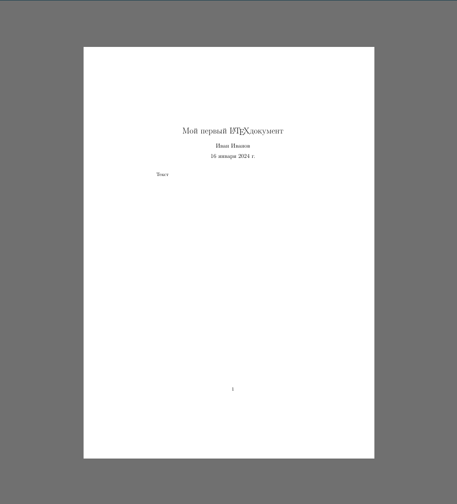
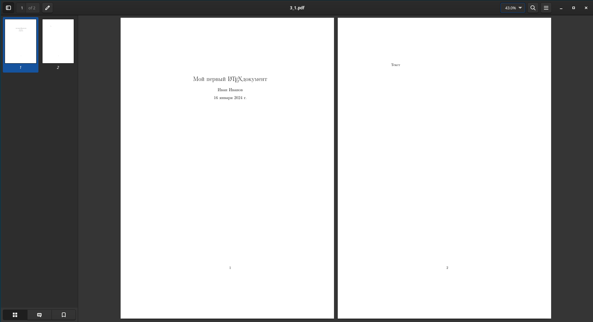
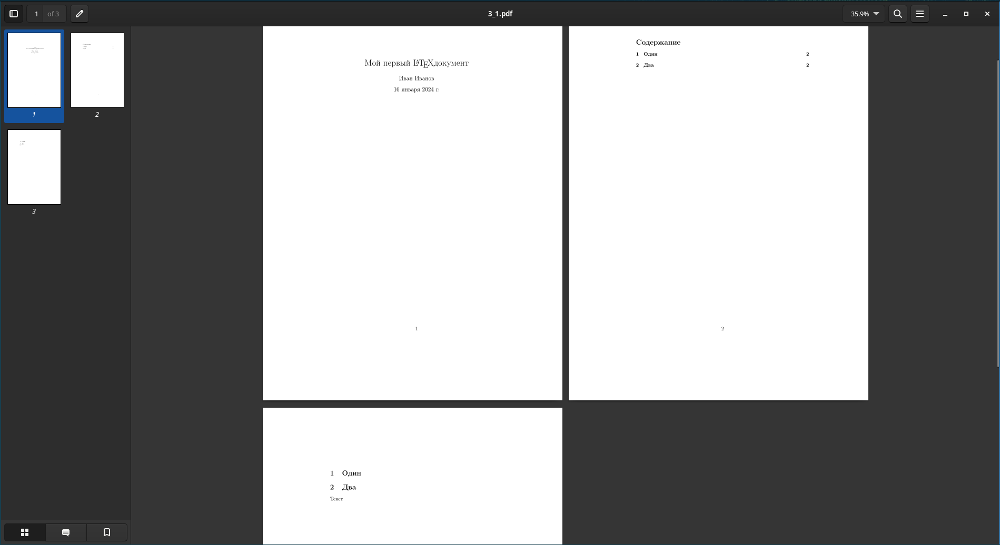

# Преамбула документа
---
В прошлом параграфе мы создали простейший LaTeX документ. В этом параграфе мы добавим в документ заголовок, оглавление и многое другое.\
## Добавление заголовка, автора, даты создания документа
Вернёмся к прошлому документу:
```latex
\documentclass{article}
\usepackage[english,russian]{babel}
\begin{document}
Текст
\end{document}
```
В LaTeX можно красиво и просто указать наше авторство, просто добавив несколько строк в код:
```latex
\documentclass{article}
\usepackage[english,russian]{babel}

% Указание заголовка, авторства и даты создания документа
\author{Иван Иванов}
\title{Мой первый \LaTeX документ}
\date{\today} % \today -- сегодняшняя дата, можно заменить на любую другую.

\begin{document}

% Добавление заголовка в документ
\maketitle

Текст
\end{document}
```
_Знак `%` используется в LaTeX документах для добавления комментариев к коду, т.е. код после знака процента выполняться не будет. Аналоги в языках программирования: `Python:#; Java,C(++),многие_другие://; Lisp:;`_
Результат:

Как видим, в документе появились заголовок, автор и дата создания документа. Но они не очень красиво расположены. Документ выглядит лучше, когда заголовок расположен на отдельной странице. Чтобы прервать страницу после окончания заголовка, нужно добавить строку `\newpage` сразу после `\maketitle`, очевидно почему:
```latex
\documentclass{article}
\usepackage[english,russian]{babel}

% Указание заголовка, авторства и даты создания документа
\author{Иван Иванов}
\title{Мой первый \LaTeX документ}
\date{\today} % \today -- сегодняшняя дата, можно заменить на любую другую.

\begin{document}

% Добавление заголовка в документ
\maketitle

% Разделение страницы
\newpage

Текст
\end{document}
```
Результат:

Даже страницы автоматически пронумеровались. Также здесь автоматически нумеруются главы и многое другое, это как раз одно из преимуществ LaTeX над такими текстовыми процессорами, как Word. Можно приступать к оглавлению\
## Оглавление
Обычно LaTeX автоматически создаёт оглавление основываясь на главах в документе. Давайте просто для примера вставим перед текстом следующие строки:
```latex
\section{Один}
\section{Два}
```
Это введено для примера чтобы показать, как работает оглавление. Более подробно команды chapter, section и другие будут рассмотрены в следующих параграфах, пока это знать не обязательно.\
Далее нужно создать само оглавление для фрагмента выше, добавив в LaTeX код команду \tableofcontents{} как в примере ниже:
```latex
\documentclass{article}
\usepackage[english,russian]{babel}

% Указание заголовка, авторства и даты создания документа
\author{Иван Иванов}
\title{Мой первый \LaTeX документ}
\date{\today} % \today -- сегодняшняя дата, можно заменить на любую другую.

\begin{document}

% Добавление заголовка в документ
\maketitle

% Разделение страницы
\newpage

% Оглавление
\tableofcontents{}

\section{Один}
\section{Два}

Текст
\end{document}
```

И снова всё получилось. В следующих параграфах будут рассмотрены другие темы.
