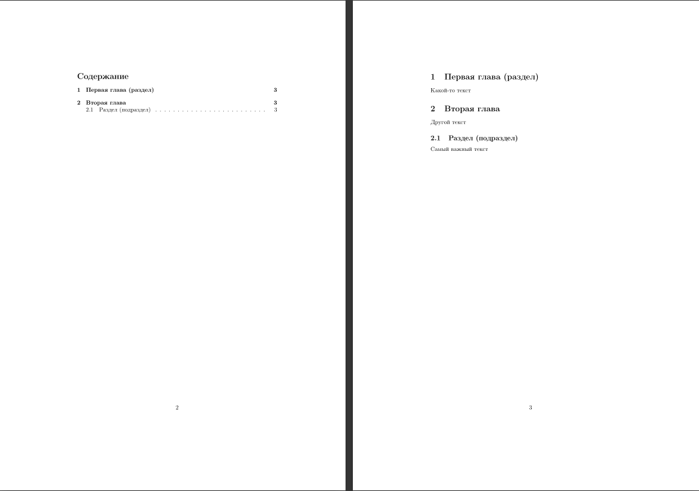

# Разделение текста на главы и разделы
---
В прошлом параграфе было рассмотрено создание оглавления на основе существующих глав, но как создавать эти главы, подробно рассказано не было. В этом параграфе разделение текста на главы и разделы будет рассмотрено более подробно.
## Создание глав
Вообще, класс _article_ в LaTeX не поддерживает создание глав, здесь можно создавать только разделы, подразделы и параграфы, поэтому здесь будем считать, что раздел -- глава, а подраздел -- раздел главы. Если Вы выбрали класс документа _book_, то Вы можете создавать настоящие главы на примере следующего кода:
```latex
\section{название_главы}
% Содержание главы
```
А выглядит это примерно так:


А теперь рассмотрим способ создания разделов и подразделов в документе с классом _article_ на примере LaTeX-кода из предыдущих параграфов:
```
\documentclass{article}
\usepackage[english,russian]{babel}

% Указание заголовка, авторства и даты создания документа
\author{Иван Иванов}
\title{Мой первый \LaTeX документ}
\date{\today} % \today -- сегодняшняя дата, можно заменить на любую другую.

\begin{document}

% Добавление заголовка в документ
\maketitle

% Разделение страницы
\newpage

% Оглавление
\tableofcontents{}
\newpage

% Первая и вторая глава
\section{Первая глава (раздел)}
Какой-то текст
\section{Вторая глава}
Другой текст
\subsection{Раздел (подраздел)}
Самый важный текст
\end{document}
```
Так выглядят страницы 2 и 3 документа (первая страница -- название документа, авторство и т.д.):

Команды `\section{...}` и `\subsection{...}` создают разделы и подразделы соответственно. На изображении выше показано, как выглядят секции и подсекции. Вы можете добавлять и подразделы для подразделов, просто добавив ещё одну приставку sub:\
```latex
\subsubsection{Подраздел подраздела}
```
Приставки sub можно добавлять в неограниченном количестве.\
Важно заметить, что в фигурных скобках также нельзя вводить спецсимволы, перечисленные во втором параграфе.

