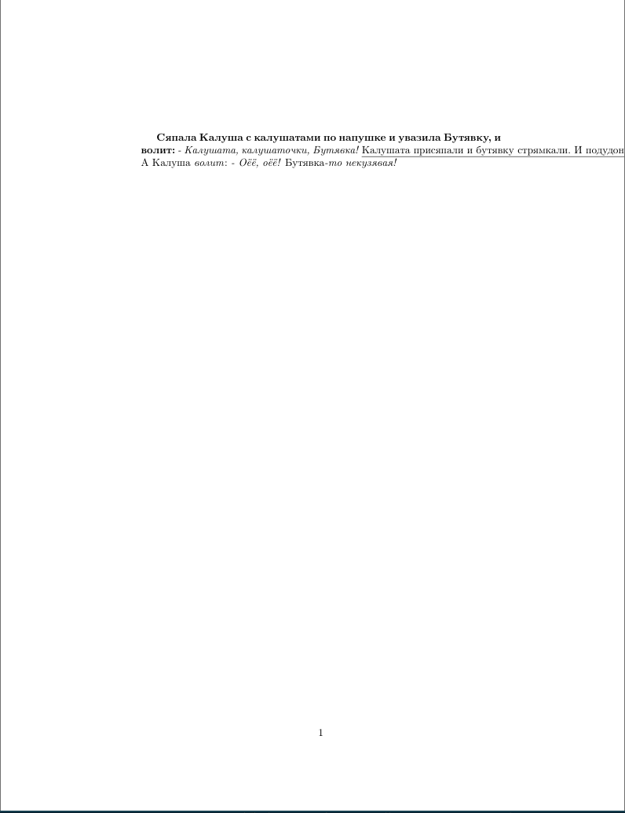
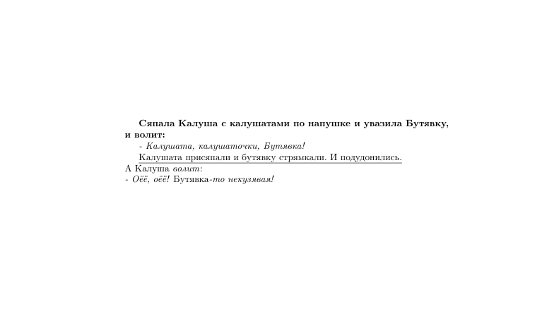

# Форматирование текста
---
Для того, чтобы сделать текст полужирным, подчёркнутым, под наклоном, нужно запомнить несколько комманд:
```latex
% Полужирный
\textbf{текст}

% Текст под наклоном (italic)
\textit{текст}

% Подчёркнутый
\underline{текст}

% Дополнительно: выделение какого-то текста
\emph{текст}
```
Команда `emph` (от слова emphasis -- акцент) добавляет наклон какому-то фрагменту в тексте, если весь текст не находится под наклоном, или наоборот убирает наклон, если весь текст находится под наклоном.\
Создадим новый LaTeX документ для того, чтобы продемонстрировать работу вышеперечисленных команд:
```latex
\documentclass{article}
\usepackage[english,russian]{babel}

\begin{document}

\textbf{Сяпала Калуша с калушатами по напушке и увазила Бутявку, и волит:}
\textit{- Калушата, калушаточки, Бутявка!}
\underline{Калушата присяпали и бутявку стрямкали. И подудонились.}
А Калуша \emph{волит}:
\textit{- Оёё, оёё! \emph{Бутявка}-то некузявая!}

\end{document}
```
Как выглядит такой текст:

Ужас! Строки не переносятся! Что же делать? Для того, чтобы сделать перенос строки, в LaTeX коде нужно либо нажать Enter дважды, либо ввести \\\ в конце строки:
```latex
\documentclass{article}
\usepackage[english,russian]{babel}

\begin{document}

\textbf{Сяпала Калуша с калушатами по напушке и увазила Бутявку, и волит:}

\textit{- Калушата, калушаточки, Бутявка!}

\underline{Калушата присяпали и бутявку стрямкали. И подудонились.}\\
А Калуша \emph{волит}:\\
\textit{- Оёё, оёё! \emph{Бутявка}-то некузявая!}

\end{document}
```

На этом примере можно также увидеть разницу между переносом строки через двойное нажатие Enter и через \\\\: двойной Enter создаёт новый абзац, а \\\ просто переносит строку. Обычно LaTeX переносит строки сам, но бывают случаи, когда слово просто не влезает в документ (как на первом фото) и приходится делать перенос строки вручную.\
Вы также можете применять сразу несколько команд к одному фрагменту текста:
```latex
\textbf{\textit{Бубубубубубу}}
```

