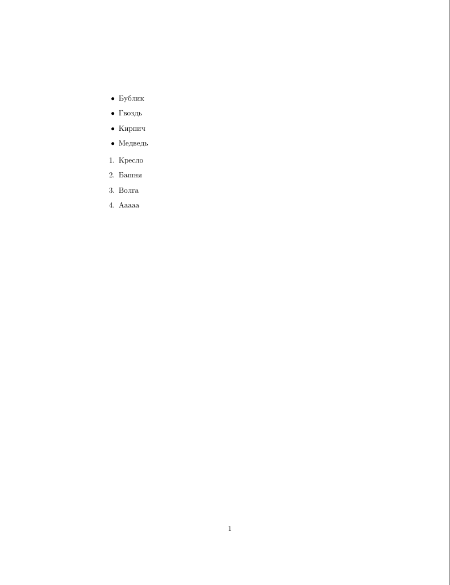

# Списки
---
Списки бывают беспорядочные и упорядоченные. Отличаются они лишь тем, что слева от беспорядочного элемента списка находится точка, а слева от упорядоченного -- порядковый номер элемента. Для создания списка используются команды `\begin{...}` и `\end{...}`, как при создании тела документа. Создадим новый документ по шаблону:
```latex
\documentclass{article}
\usepackage[english,russian]{babel}

\begin{document}

% Инициализация списка
\begin{?}
% Содержимое списка
...

\end{?}

\end{document}
```
Чтобы создать список, вместо знака вопроса в шаблоне выше нужно ввести название среды. Для создания беспорядочного списка знак вопроса нужно заменить на `itemize`, а для создания упорядоченного списка -- на `enumerate`:
```latex
\documentclass{article}
\usepackage[english,russian]{babel}

\begin{document}
% Инициализация списков
\begin{itemize}

...

\end{itemize}
\begin{enumerate}

...

\end{enumerate}
\end{document}
```
Теперь списки нужно заполнить какими-то элементами. Для добавления элемента в список нужно использовать команду `item`
```
\documentclass{article}
\usepackage[english,russian]{babel}

\begin{document}
% Инициализация списков
\begin{itemize}
\item Бублик
\item Гвоздь
\item Кирпич
\item Медведь
\end{itemize}
\begin{enumerate}
\item Кресло
\item Башня
\item Волга
\item Ааааа
\end{enumerate}
\end{document}
```
А выглядит такой документ вот так:

В следующем параграфе будет рассмотрено создание таблиц с помощью списков.
