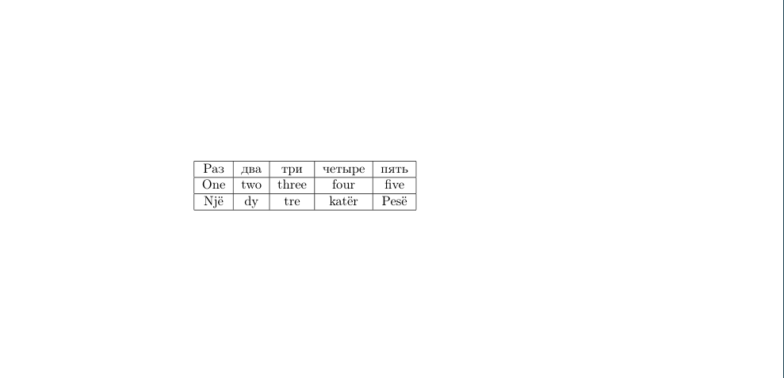

# Таблицы
---
Можно сохранить в закладки сайт [TablesGenerator](https://www.tablesgenerator.com/) и даже не читать этот параграф. Но довольно редко бывают случаи, когда нужно создать таблицу в LaTeX-документе, а доступа к интернету нет и приходится делать все вручную. В таких случаях, пожалуй, лучше записать таблицу на бумажке и переписать в TablesGenerator тогда, когда появится интернет и вставить в LaTeX-документ сгенерированную таблицу. Но если таблицу нужно прям срочно сделать и без интернета, знание материала из этого параграфа может пригодиться.\
Таблицы обычно создаются с помощью списков. Если Вы ещё не знаете, как создавать списки, рекомендуется прочитать предыдущий параграф. Снова создадим новый LaTeX-документ по следующему шаблону:
```latex
\documentclass{article}
\usepackage{english,russian}[babel]

\begin{document}

% Будущая таблица
\begin{?}
...
\end{?}

\end{document}
```
Для создания таблиц в LaTeX используется окружение `tabular`. Оно отличается от таких окружений, таких как `itemize` и `enumerate` тем, что ему также нужно присвоить параметр, который отвечает за количество столбцов в таблице. Этот параметр присваивается так: после `\begin{tabular}` без пробелов и переносов строк нужно ввести `{...}`, где вместо многоточия через пробел вводятся буквы `c` от слова _column_. Количество введённых букв `c` означает количество столбцов. Звучит не очень понятно, поэтому лучше разобрать это на примере: 
```latex
\documentclass{article}
\usepackage[english,russian]{babel}

\begin{document}

\begin{tabular}{c c c c c}
Раз & два & три & четыре & пять \\
One & two & three & four & five \\
Njё & dy & tre & katёr & Pesё
\end{tabular}

\end{document}
```
Также нужно отметить, что для перехода к следующему столбцу используется символ `&` (амперсанд), а для перехода к следующей строке -- `\\` (двойной обратный слэш). `\\` также пригодится при вводе математических записей, это будет рассмотрено в одном из следующих параграфов.\
Скомпилировав код выше, получим такой документ:

Видно, что таблица не имеет границ. Чтобы их добавить, нужно разделить `c` в `{c c c c c}` с помощью символа `|`:
```latex
\documentclass{article}
\usepackage[english,russian]{babel}

\begin{document}

\begin{tabular}{c|c|c|c|c}
Раз & два & три & четыре & пять \\
One & two & three & four & five \\
Njё & dy & tre & katёr & Pesё
\end{tabular}

\end{document}
```

Как видим, столбцы разграничены, теперь нужно разграничить строки. Для этого используется команда `\hline` (от horizontal line):
```latex
\documentclass{article}
\usepackage[english,russian]{babel}

\begin{document}

\begin{tabular}{c|c|c|c|c}
Раз & два & три & четыре & пять \\
\hline
One & two & three & four & five \\
\hline
Njё & dy & tre & katёr & Pesё
\end{tabular}

\end{document}
```

И напоследок хорошо бы добавить границы для всей таблицы. Это делается очень просто, надо всего лишь добавить линии границ в начала и концы перечисления столбцов и строк соответственно: 
```latex
\documentclass{article}
\usepackage[english,russian]{babel}

\begin{document}

\begin{tabular}{|c|c|c|c|c|}
\hline
Раз & два & три & четыре & пять \\
\hline
One & two & three & four & five \\
\hline

% Здесь нужно добавить в конце \\, иначе выйдет ошибка 
Njё & dy & tre & katёr & Pesё \\
\hline
\end{tabular}

\end{document}
```

Как видите, теперь таблица выглядит так, как должна выглядеть таблица.\
Вы также можете добавлять отступы между строками, добавляя в квадратных скобках значение отступа в дюймах, сантиметрах, пунктах, пиках и так далее:
```latex
\documentclass{article}
\usepackage[english,russian]{babel}

\begin{document}

\begin{tabular}{|c|c|c|c|c|}
\hline
Раз & два & три & четыре & пять \\ [0.5cm]
\hline
One & two & three & four & five \\
\hline

% Здесь нужно добавить в конце \\, иначе выйдет ошибка 
Njё & dy & tre & katёr & Pesё \\
\hline
\end{tabular}

\end{document}
```

Полная таблица единиц измерения, которые здесь можно применить:

| pt                                   | mm | cm | in   | ex                                          | em                                        | mu      | sp                                                  |
|--------------------------------------|----|----|------|---------------------------------------------|-------------------------------------------|---------|-----------------------------------------------------|
| примерно 0.0138 дюймов или 0.3515 мм | мм | см | дюйм | высота маленькой буквы используемого шрифта | высота большой буквы используемого шрифта | 1/18 em | низкоуровневая ед. измерения, где 1sp = 1/(65536pt) |

