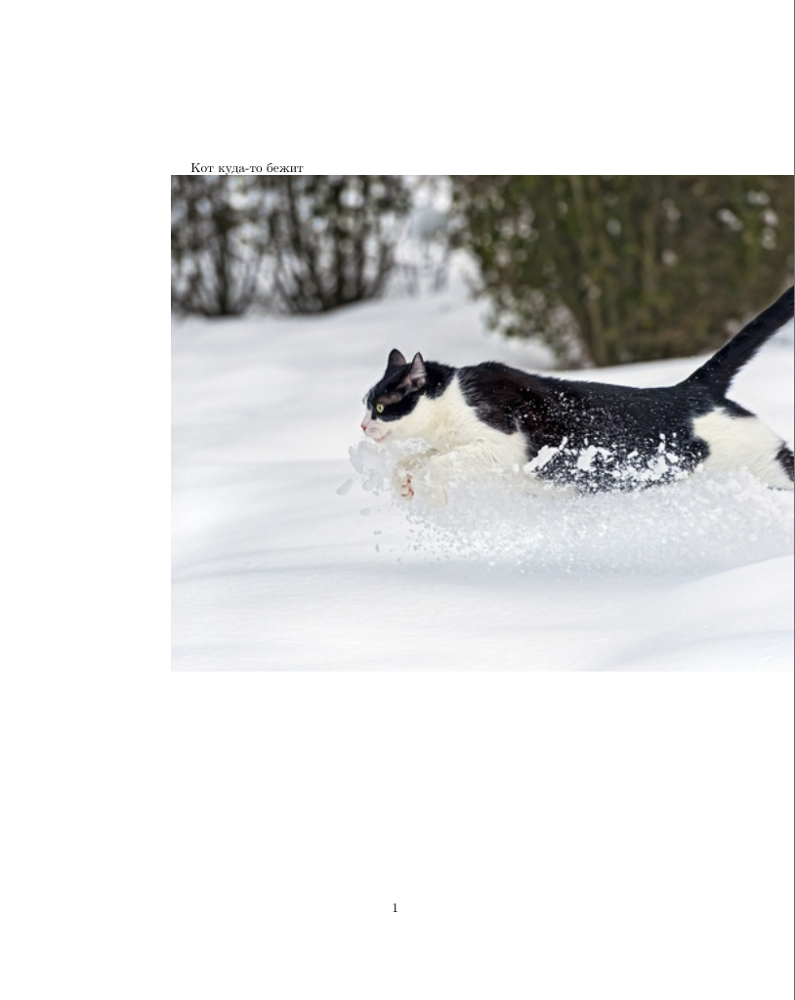
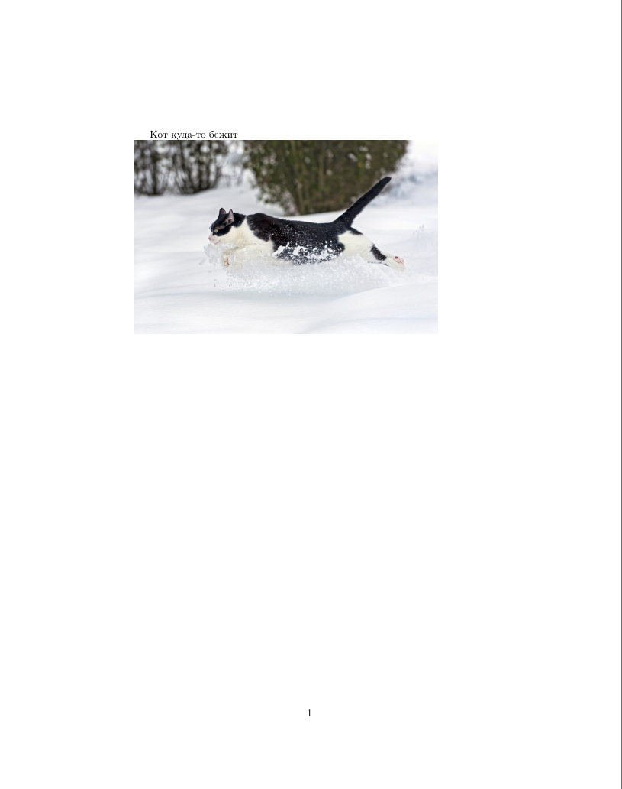
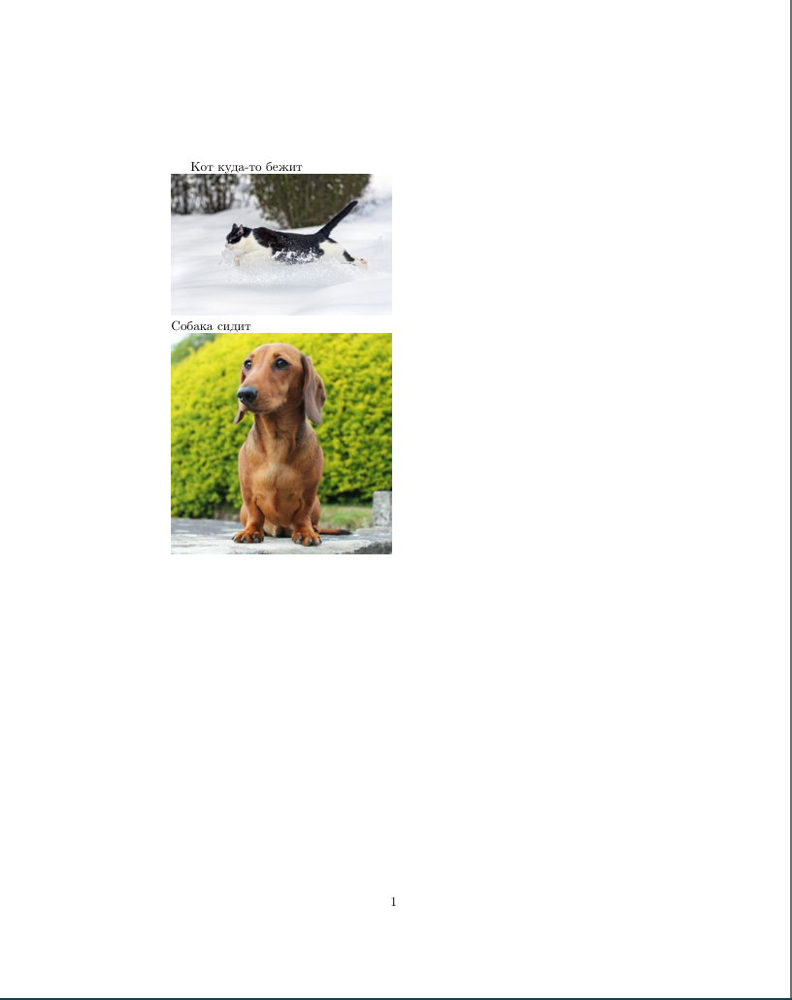
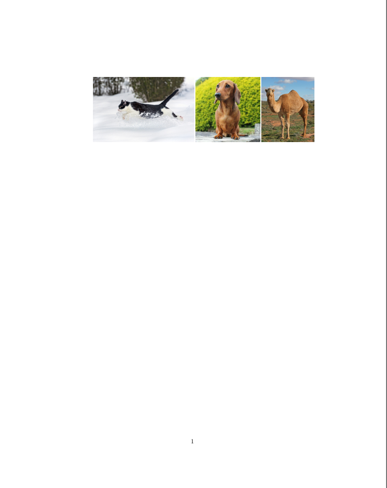
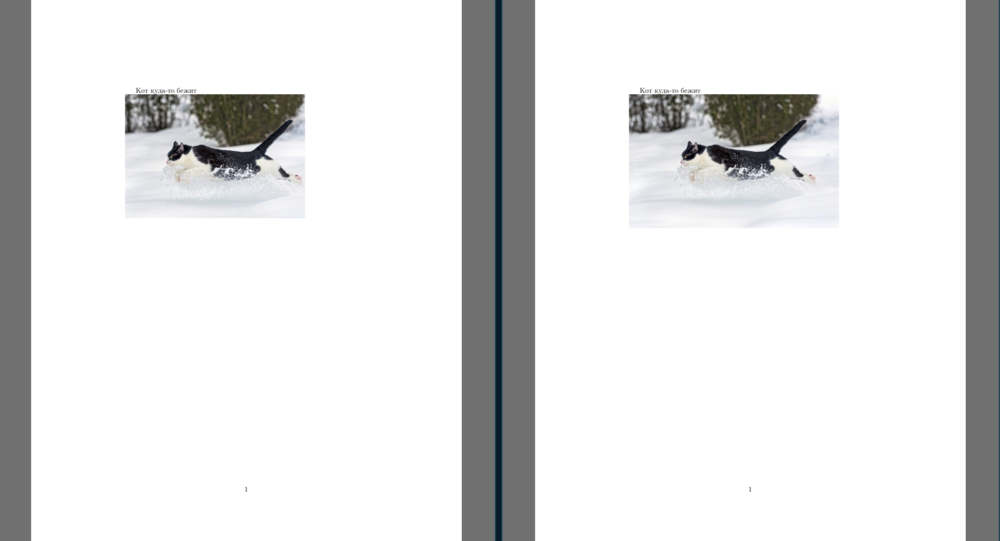
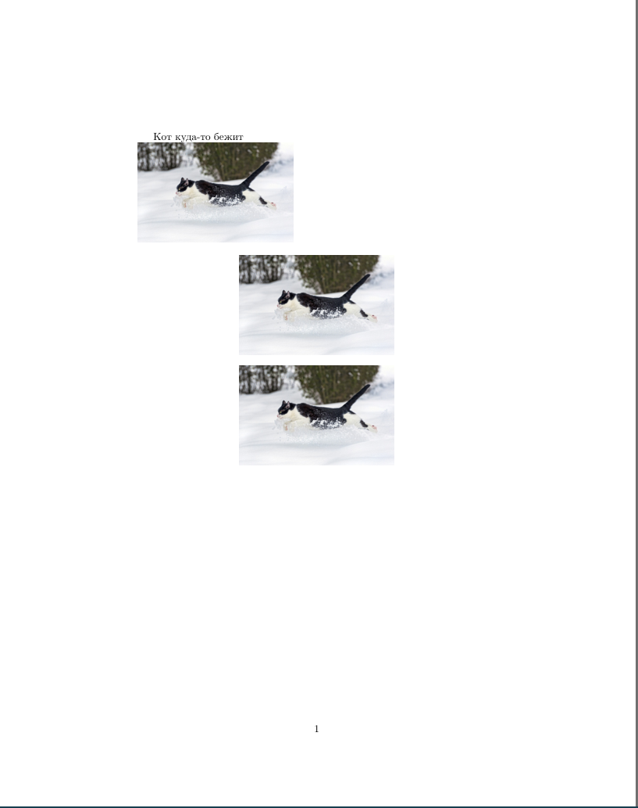
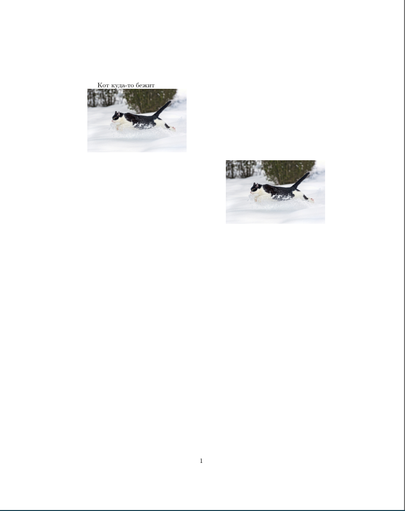
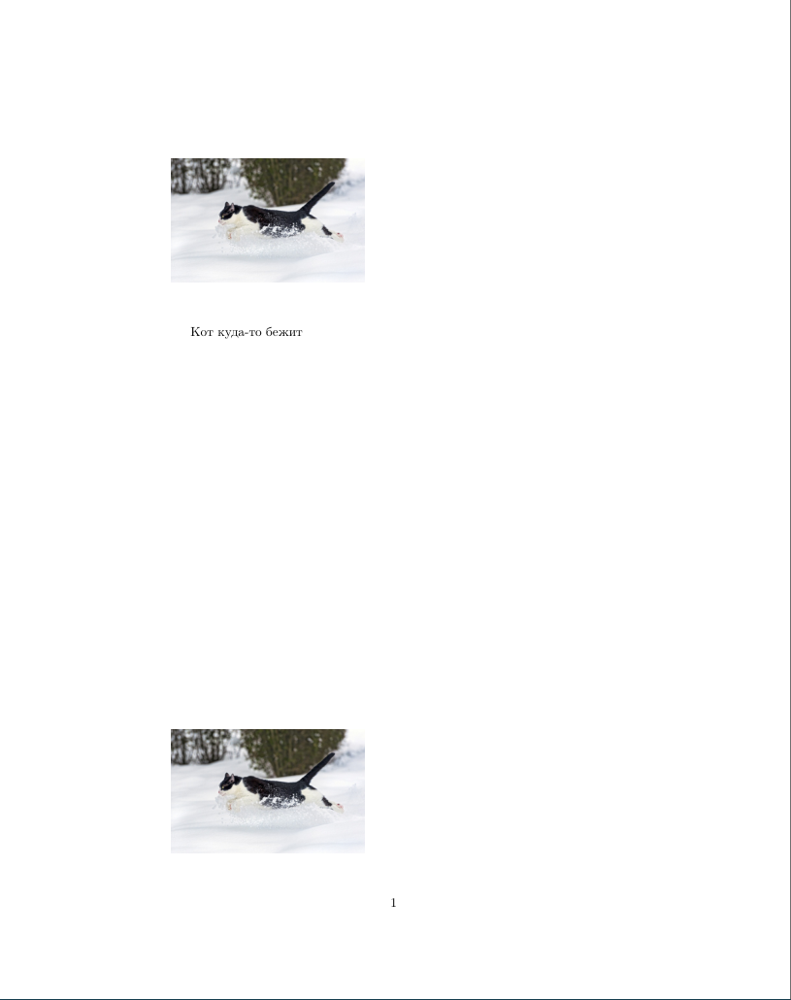
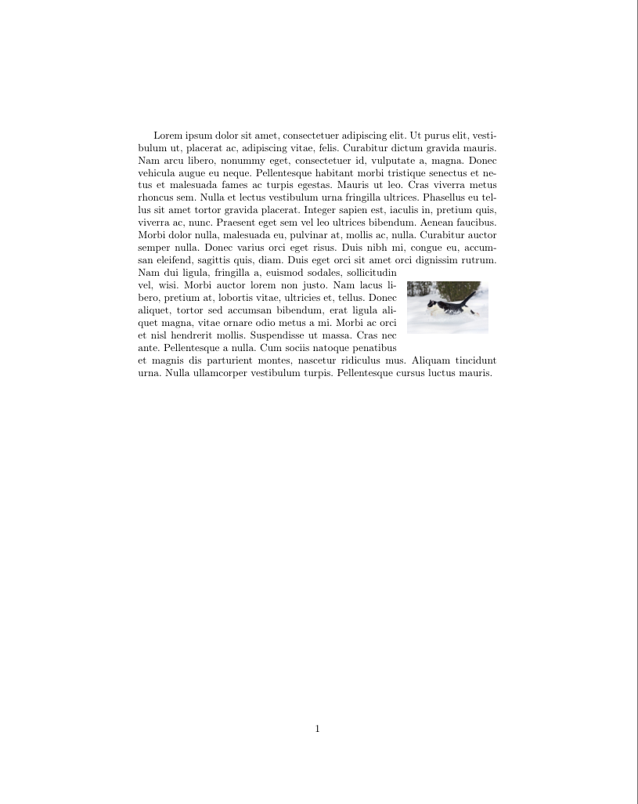

# Вставка изображений
---
Для того, чтобы в документ возможно было добавить изображение, нужно импортировать пакет `graphicx`. Вставляется изображение с помощью команды `includegraphics`. Создадим документ по шаблону:
```
\documentclass{article}
\usepackage[english,russian]{babel}

% Импорт пакета graphicx
\usepackage{graphicx}

\begin{document}
Кот куда-то бежит
\includegraphics{путь_к_картинке}
\end{document}
```
Вместо путь\_к\_картинке нужно указать, как ни странно, путь к изображению, которое Вы хотите вставить. Например, так:
```
\documentclass{article}
\usepackage[english,russian]{babel}

% Импорт пакета graphicx
\usepackage{graphicx}

\begin{document}
Кот куда-то бежит \\
\includegraphics{cat.jpg}
\end{document}
```
Это сработает только в том случае, если файл cat.png находится в той же папке, в которой находится сам документ. В противном случае, нужно указывать либо полный путь к файлу, либо путь к файлу в подпапке (например, так: images/cat.png). Но есть способ удобнее: если Вы используете одну папку для всех изображений в документе, Вы можете указать путь к ней, добавив в начало тела документа следующую строку:
```
\graphicspath{путь_к_папке}
```
и использовать изображения оттуда просто вводя имя файла как в примере выше.\
Если все получилось, то документ должен выглядеть примерно так:

## Изменение размера изображения
Если фото, которое Вы добавляете в документ слишком большое, как в примере, Вы можете изменить его размер. Для этого нужно добавить параметр `scale`:
```latex
\documentclass{article}
\usepackage[english,russian]{babel}

% Импорт пакета graphicx
\usepackage{graphicx}

\begin{document}
Кот куда-то бежит \\
\includegraphics[scale=0.5]{cat.jpg}
\end{document}
```

Возможно, Вам хочется, чтобы все изображения имели одинаковую ширину или высоту в документе. Для этого к изображениям применяются параметры `width` и `height` (ширина и высота соответственно)
```latex
\documentclass{article}
\usepackage[english,russian]{babel}

% Импорт пакета graphicx
\usepackage{graphicx}

\begin{document}
Кот куда-то бежит \\
\includegraphics[width=6cm]{cat.jpg} \\
Собака сидит \\
\includegraphics[width=6cm]{dog.jpg}
\end{document}
```

```latex
\documentclass{article}
\usepackage[english,russian]{babel}

% Импорт пакета graphicx
\usepackage{graphicx}

\begin{document}
\includegraphics[height=3.6cm]{cat.jpg}
\includegraphics[height=3.6cm]{dog.jpg}
\includegraphics[height=3.6cm]{camel.jpg}
\end{document}
```

Если Вам нужно обрезать фото, это можно сделать прямо в LaTeX с помощью ключевых слов `trim` и `clip`:
```latex
\documentclass{article}
\usepackage[english,russian]{babel}

% Импорт пакета graphicx
\usepackage{graphicx}

\begin{document}
Кот куда-то бежит \\
\includegraphics[trim={1cm, 1cm, 2cm, 0cm},clip,scale=0.5]{cat.jpg}
\end{document}
```
Наглядное сравнение обрезанного изображения (слева) и исходного (справа):


## Центрирование изображений
Есть два способа центрировать изображение: через `\centering`, и через помещение изображения в окружение `center`. Рассмотрим оба:
```latex
\documentclass{article}
\usepackage[english,russian]{babel}

% Импорт пакета graphicx
\usepackage{graphicx}

\begin{document}
Кот куда-то бежит \\
\includegraphics[scale=0.25]{cat.jpg} \\

{\centering
\includegraphics[scale=0.25]{cat.jpg}
\par}

\begin{center}
\includegraphics[scale=0.25]{cat.jpg} \\
\end{center}
\end{document}
```

Оба способа дают один и тот же результат, поэтому можете использовать тот способ, который Вам больше нравится. 
## Расширенное изменение расположения изображения
### Расположение изображения справа
Чтобы расположить изображение в документе справа, проще всего воспользоваться пакетом `adjustbox`, добавить параметр left/right/inter/outer (inter и outer -- для двухсторонних документов). В данном случае воспользуемся параметром `right`. Кстати, Вы можете также центрировать изображение таким образом, просто добавив параметр `center`.
```latex
\documentclass{article}
\usepackage[english,russian]{babel}

% Импорт пакетов graphicx и adjustbox
\usepackage{graphicx}
\usepackage[export]{adjustbox}

\begin{document}
Кот куда-то бежит \\
\includegraphics[scale=0.25]{cat.jpg} \\

\includegraphics[scale=0.25, right]{cat.jpg}

\end{document}
```

### Среда figure
Среда `figure` открывает множество возможностей по изменению расположения изображения. Пример:
```latex
\documentclass{article}
\usepackage[english,russian]{babel}

% Импорт пакетов graphicx и adjustbox
\usepackage{graphicx}
\usepackage[export]{adjustbox}

\begin{document}
Кот куда-то бежит \\
\begin{figure}[t]
\includegraphics[scale=0.25]{cat.jpg} \\
\end{figure}
\begin{figure}[b]
\includegraphics[scale=0.25]{cat.jpg} \\
\end{figure}

\end{document}
```

Видим, что изображения разместились в начале документа и в конце документа. Так получилось благодаря параметрам t -- top и b -- bottom для окружения `figure`. Полный список параметров для `figure` (можно использовать сразу несколько параметров, вводить их нужно без пробелов и знаков препинания):

| t (top)          | b (bottom)      | h (here)                                           | H  | p (page)                        | !                                                                      |
|------------------|-----------------|----------------------------------------------------|----|---------------------------------|------------------------------------------------------------------------|
| располож. вверху | располож. внизу | примерно здесь (в том же месте, где пишется текст) | h! | располож. на отдельной странице | убрать "примерно" (параметры LaTeX для определения правильной позиции) |

### Расположение текста "вокруг" изображения
Иногда красиво вставить изображение прямо в текст, чтобы текст был расположен как бы "вокруг" изображения. Для реализации такой цели используется пакет `wrapfig`. Реализация такого расположения происходит так: создаётся среда `wrapfigure` с параметрами {расположение}{размер} и туда добавляется картинка:
```latex
\documentclass{article}
\usepackage[english,russian]{babel}
\usepackage{lipsum} % lipsum -- генерация текста Lorem Ipsum
\usepackage{graphicx}
\usepackage{wrapfig}

\begin{document}
\lipsum[1]
\begin{wrapfigure}{r}{0.25\textwidth}
\includegraphics[width=0.9\linewidth]{cat.jpg}
\end{wrapfigure}
\lipsum[2]
\end{document}
``` 

Таблица с параметрами расположения изображения:

| l (left) | r (right) | c (center) | i (inner)                           | o (outer)                           |
|----------|-----------|------------|-------------------------------------|-------------------------------------|
| справа   | слева     | по центру  | см. Расположение изображения справа | см. Расположение изображения справа |


